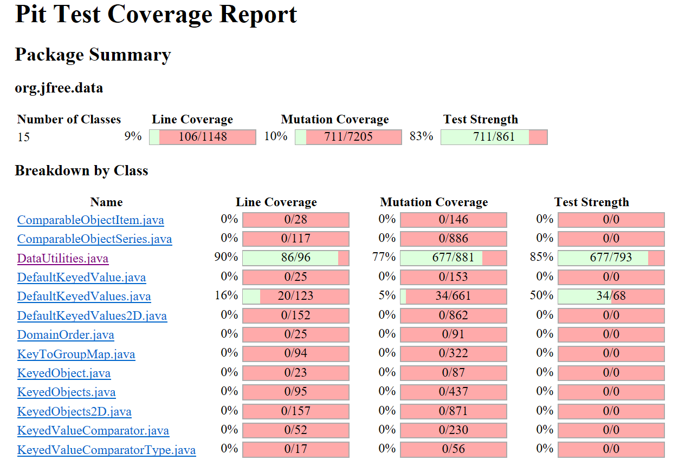
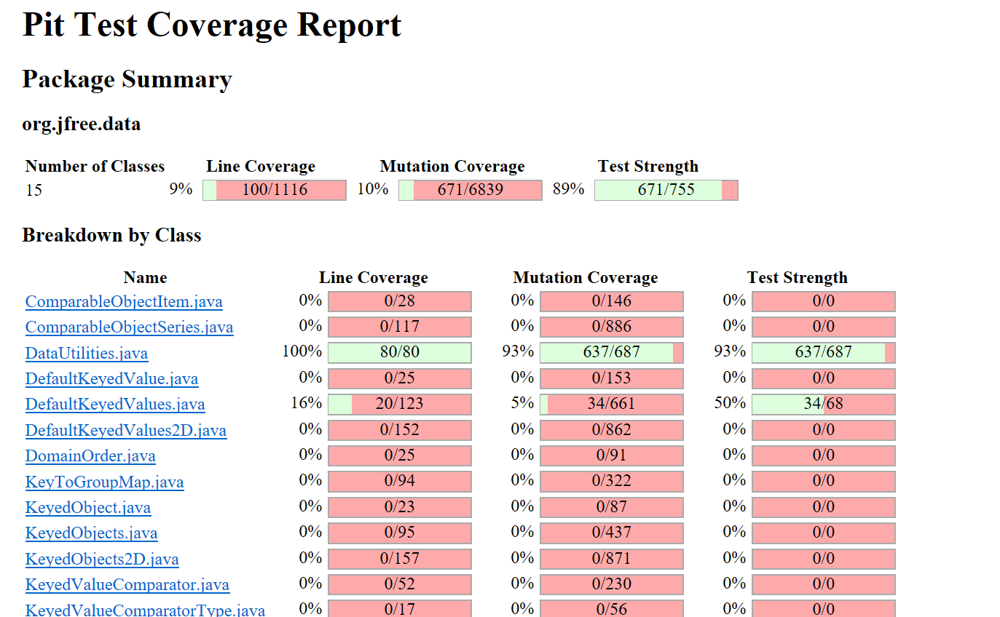
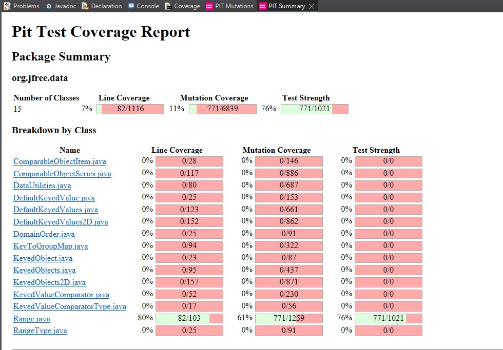
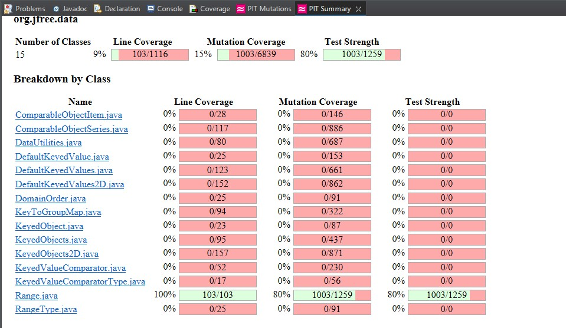
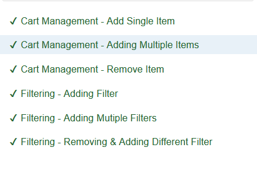
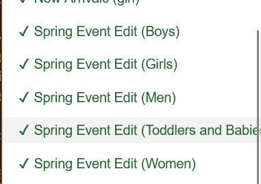
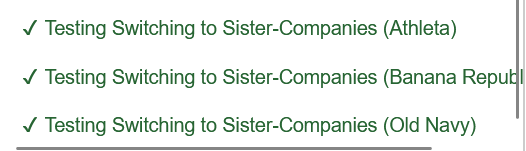
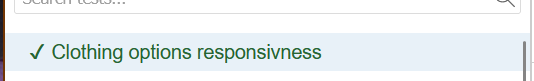

**SENG 438 - Software Testing, Reliability, and Quality**

**Lab. Report \#4 – Mutation Testing and Web app testing**

| Group \#: 16   |     |
| -------------- | --- |
| Student Names: |     |
| Badhwar, Sukriti|     |
| BANMAN, Wade   |     |
| Lange, Rohan   |     |
| Thethi, Sahib  |     |

# Introduction

In this lab our group explored two newly introduced testing techniques, mutation testing and GUI testing, on the JFreeChart artifact and the Gap website artifact. For mutation testing we primarily focused on understanding mutations and how testing mutations of your code can help you to access the strength of your test cases by detecting area's with insufficient coverage and edge cases that have been missed. By increasing your test suites mutation score you ensure that the robustness of the suite is adequate and ensures that accidental changes made to the artifact will be detected before deployment. As for GUI testing, our group focused on automated GUI tests created with mouse recording software and inserted verification check points to ensure proper results. We found that automating GUI test can greatly increase the accuracy and efficiency of GUI testing while also allowing for simple regression testing. Selenium made creating automated GUI tests an increadibly user friendly and simple to execute experience while also ensuring correctness and accuracy.

# Analysis of 10 Mutants of the Range class 

| Mutation   |  Function  | Reason for Survival / Killing |
| -------------- | --- | ---|
| Substituted 2.0 with -1.0 |  getCentralValue   | Killed: `testgetCentralvalue()` properly checks for correct return value if constant required is changed |
| Replaced division with subtraction |  getCentralValue   | Killed: `testgetCentralvalue()` returns false answer when operation is changed within function |
|  Replaced double subtraction with multiplication  |  getLength  | Killed: All tests for getLength will respond the same when the operation is swapped out |
| Removed Conditional to always false | combine, if (range1 == null) | Killed: `testCombineleftNull()` Without this conditional, this test doesn't return its proper value |
|  Removed call to getUpperBound |  expand, `double upper = range.getUpperBound() + length * upperMargin;`  | Killed: SAny of the expand tests will go across the changed line which directly affects any returning value |
| less than to less than or equal| contains | Survives: There are no tests that check the boundaries of the contain function  |
| Greater than to equal | intersects | Survives: There are no tests that if a range completely below the test range intersects |
| Substituted 0 with -1.0 | shiftWithNoZeroCrossing | Survives: There are no tests that test shifting a number between -1 and 0 towards 0 with no zero crossing |
| Removed conditional - replaced comparison check with true| shiftWithNoZeroCrossing | Survives: There are no tests that test shifting 0 in the positive direction with no zero crossing |
| Removed call to java/lang/StringBuilder::toString | Range() | Survives: There are no tests that make a call to the constructor trying to create a range with its lower boundary greater than its upper boundary |

# Report all the statistics and the mutation score for each test class
**Data Utilities score before adding additional test cases -**

**Data Utilities score after adding additional test cases to improve mutation score -**

The Data utilities mutation score increased from 77% to 93% and the test score increased from 85% to 93%. The Following are some exmaples test cases that were added to improve the mutation score of Data Utilities class -

**1. testCalculateColumnTotal_NullData_ShouldThrowException():** 
This test ensures that calculateColumnTotal throws an IllegalArgumentException when data is null. The mutant removed the nullNotPermitted check, allowing null to pass, which would cause a NullPointerException instead. Since the test explicitly expects an IllegalArgumentException, the mutant fails, effectively killing it. Similar tests were added for all the methods of Data Utilities class.

**2. testCalculateColumnTotal_EmptyData():** 
This test ensures that calculateColumnTotal correctly handles an empty dataset by returning 0.0. The mutant changed the loop condition from r < rowCount to r != rowCount, which allowed the loop to execute incorrectly when rowCount == 0. The test explicitly checks for this case, ensuring the loop does not execute, forcing the correct return value of 0.0, effectively killing the mutant. Similar tests were added for all the methods of the DataUtilities class.

**3. testCalculateColumnTotal_CorrectSummation():** 
This test ensures that calculateColumnTotal correctly sums the values in a given column. The test mocks a Values2D object with three rows, assigning values 1.5, 2.5, and 3.0 to column index 0. The expected sum is 7.0. A mutant that alters the summation logic such as - skipping a value, modifying an arithmetic operation, or incorrectly handling row iteration would produce an incorrect total, causing the test to fail and effectively killing the mutant. Similar summation validation tests were added for other methods of the DataUtilities class.

**4. calculateColumnTotalWithNegativeNumbers():**  
This test ensures that calculateColumnTotal correctly sums values in a column when negative numbers are present. The test mocks a Values2D object with three rows, assigning values -1.0, 2.5, and -3.5 to column index 0. The expected sum is -2.0. A mutant that mishandles negative numbers such as incorrectly adding them, ignoring their sign, or miscalculating the summation would cause this test to fail, effectively killing the mutant. Similar tests were added for handling different numerical ranges in the DataUtilities class.

**Range score before adding additional test cases -**

**Range score after adding additional test cases to improve mutation score -**

The RangeTest mutation score increased from 61% to 80% and the test score increased from 76% to 80%. The following are some of the ways the test suite was changed to improve the mutation score

**1. Checking value of objects being used for static method calls:**
Several of the mutants created resulted in incrementations or decrementation to the upper and lower values of the range after they were used within a static method, however many of the static methods contain only a single call to that component so the change to the boundaries of the range goes unnoticed. As such we altered some of our tests such as testLowerAndUpperMarginGreaterThanOne() to check the boundaries of the range after being passed to the static method expand to ensure that it remained unchanged.

**2. increase the amount of boundary tests:**
Changes to logical expressions made up another large portion of mutations that were going unoticed as we had insufficient boundary coverage for the 15 range methods. by increasing the boundary coverage we were able to eliminate many mutants that made changes such as changing a greater than to a greater than or equal to as the equal to case was now being tested. An example of a test created to serve this purpose is testBarelyIntersectsPositiveWithRange().
# Analysis drawn on the effectiveness of each of the test classes

**DataUtilities Class**

The PIT Test Coverage Reports for the DataUtilities class show a significant improvement in mutation score, line coverage, and test strength after adding the new test cases. Let's break down the effectiveness of each test case and analyze their contributions to these improvements.

Overall Impact on DataUtilities Class Metrics
- Before Adding Test Cases:
    - Mutation Coverage: 77%
    - Test Strength: 85%
- After Adding Test Cases:
    - Mutation Coverage: 93% (637/687 mutants killed)
    - Test Strength: 93%

For the DataUtilities class, the mutation score increased from 77% to 93%, showing that the new test cases were effective in killing more mutants, thus improving the robustness of the tests against potential faults. The test strength also increased from 85% to 93%, reflecting that the tests are now more capable of detecting faults introduced by mutations.

**Range Class**

The PIT test coverage for the range class was increased by 19% as a result of the tests added to the suite while also increasing line coverage to 100% and test coverage to 80%. These changes demonstrate the increase of robustness testing within the test cases allowing for superior detection of mutants or accidental changes during production before they are deployed. Of the remaining mutants, a sizeable percentage of them are equivalent mutants which cannot be detected as a result of testing and as such effectively increase the true mutation score to an even better result. Overall as a result of these additions the Range test suite is now a far more effective test suite.

# A discussion on the effect of equivalent mutants on mutation score accuracy
When mathematically equivalent expressions are switched, unused variables are changed, or conditions that don't affect results because of preexisting logic are adjusted, the original code is modified; these changes are known as equivalent mutants. These mutations are produced by tools in mutation testing, but no test suite can identify them because their output is identical to that of the original program for every input. Consequently, they survive, increasing the number of mutants that survive and having a direct effect on the mutation score, which is determined by dividing the number of killed mutants by the total number of mutants generated.

The accuracy of the mutation score is distorted by the survival of equivalent mutants. Although a test suite may successfully identify actual flaws, the existence of these undetectable mutants reduces the score and gives the false impression that the tests are of low quality. When a tool produces a large number of mutants, for example, and a sizable percentage of them are equivalent, the percentage of killed mutants falls, indicating that the test suite is not as strong as it actually is. When the problem is with the equivalency of the mutants rather than the ability of the tests, this can result in needless attempts to make the tests stronger.

Finding and eliminating equivalent mutants is crucial to resolving this and improving the reliability of the mutation score. This requires a thorough comprehension of the program's operation in order to analyze the remaining mutants and identify those that are semantically identical to the original code. A recalculated score that more accurately represents the test suite's capacity to identify real flaws is made possible by eliminating these mutants from the total count after they have been identified. Because it depends on manual inspection rather than automation, this task is difficult and time-consuming, but it is essential to ensuring that the mutation score appropriately reflects the efficacy of the test suite.

# A discussion of what could have been done to improve the mutation score of the test suites
The test suite's ability to identify flaws is indicated by the mutation score, which calculates the proportion of mutants killed by the suite out of all mutants produced by a program such as Pitest. By addressing surviving mutants those missed by current tests, through improved coverage and more accurate checks, we could have improved our test suites and raised this score. Mutants that survive are frequently the consequence of unnoticed adjustments to parameters, computations, or outputs, indicating weaknesses in our testing methodology.

Strategies than can increase the number of killed mutants:

1. Target Edge Cases and Boundaries: Adding tests with values at or just beyond decision points (e.g., equality thresholds) could detect mutants that alter comparisons or limits, exposing differences from the original behavior.

2. Expand Input Variety: Using a broader range of inputs positive, negative, zero, or extreme values would catch mutants modifying arithmetic or logic, ensuring all possible outcomes are verified.

3. Test Exception Paths: Including cases with invalid inputs that trigger exceptions could kill mutants affecting error-handling code, which might otherwise survive untested.

4. Strengthen Assertions: Refining tests to check exact outputs rather than just execution could reveal subtle deviations introduced by mutants, like altered return values.

Furthermore, identifying common surviving mutant types (such as flipped conditions or changed operators) by examining the mutation tool's report would aid in customizing these new tests. We could increase the score by gradually eliminating more mutants by using these techniques and rerunning the suite.

# Why do we need mutation testing? Advantages and disadvantages of mutation testing
In order to assess a test suite's quality, mutation testing entails producing defective code versions, or "mutants," and seeing if it can identify them. We require it because common metrics, such as code coverage, only indicate which code is run and not whether errors are caught by tests. Our test suite for a system like JFreeChart can detect actual flaws, like calculation or logic errors, by using a tool like Pitest to create mutants. This increases reliability in situations where accuracy is crucial.

Advantages:
- Better Test Quality: It reveals weak tests that pass without catching faults, pushing us to strengthen them.
- Fault Detection Insight: The mutation score shows how many mutants are killed, giving a clear measure of effectiveness.
- Realistic Error Simulation: Mutants mimic common mistakes, like swapping operators, ensuring tests handle practical issues.
- Automation Support: Tools automate mutant creation and testing, making it easier to assess large codebases.

Disadvantages:
- Time-Consuming: Testing many mutants takes much longer than running regular tests, slowing the process.
- Equivalent Mutants: Some mutants behave like the original code and can’t be killed, skewing the score and requiring manual review.
- Resource Intensive: It requires significant computational power, especially for big systems.

In conclusion, mutation testing is essential for creating strong test suites, but it also has drawbacks that must be carefully managed, such as time and complexity.

# Explain your SELENUIM test case design process
Before designing the test cases, our team first explored the website for Gap Canada. We identified all the different functionalities we could test and then divided them amongst the team members. We identified and listed the following functionalities to be tested using selenium - Login, Search, Cart Mangement, Filtering, Dropdown Bar, Hyperlinks, and clothing customization.
We then familiarised ourselves with the website and noted down the steps to take before recording the tests. each of us created our own test sets as follows -

**Login and Search Functionality:**

**Cart Mangement & Filtering Functionality:**

**New Arrivals and Spring Event Edit dropdown functionalities**

Since each of these functionalities are dropbars, each test checks if the options of the each dropbar takes the user to its proper filtered results

**Swapping to sister Companies through front page top bar and clothing customization**

Each option on the bar should take the user to its associated sister companys webpage
For the clothing customization each option is exhausted.

While making these test cases, we carefully analyzed any unpredictable results and manually addressed them by adding custom test scripts. We also implemented multiple validation checkpoints to ensure the tests produced the expected outcomes. After writing the test scripts, we executed each one to identify discrepancies and refine the tests for improved accuracy and effectiveness.

# Explain the use of assertions and checkpoints
Assertions and checkpoints in Selenium are used to verify that the system behaves as expected during test execution. They help ensure that the application’s actual output matches the expected results. Selenium automatically places these validations after user interactions, such as clicking a button, scrolling, or entering text. If an assertion fails due to an unexpected or incorrect result, the test case stops and is marked as failed at that checkpoint. This allows testers to identify issues early in the execution process. Assertions in Selenium work similarly to JUnit tests: they evaluate conditions and return a failure if the condition is not met. This helps maintain test reliability by enforcing expected outcomes throughout the automation process.

# how did you test each functionaity with different test data

## Tests that required different test data were the Cart Management and Searching test Suites as well as Login/Signup
When testing the Search function, We tested an 
- invalid or obsolete entry as a keyboard mash.
- expected string
- empty string

As for the Cart Management we tested using situations such as:
- Adding a single item
- Adding multiple items
- removing items

For Login we tested with the data:
- Signing up
- Sign In with correct email and password
- Incorrect Password with correct email
- Incorrect Email

# Discuss advantages and disadvantages of Selenium vs. Sikulix
Selenium and Sikulix are both powerful automation tools, but they differ in their approach to test execution. Selenium relies on HTML locators to interact with web elements, storing user inputs such as clicks, scrolls, and text entries. In contrast, Sikulix uses image recognition, identifying and interacting with UI elements based on stored images. The choice between Selenium and Sikulix depends on the type of application being tested. Selenium is ideal for web applications, Sikulix on the other hand, is better suited for applications with complex visual elements, such as software with numerous buttons, images, and graphical components.

Advantages of Selenium include its automation for web based applications. It works seamlessly with multiple browsers. It also integrates well with a number of testing frameworks. Lastly it is free to use and customizable to project specific needs. The disadvantages include that it cannot directly automate desktop applications, requires coding experience and selenium tests can be unreliable due to minor UI changes or unexpected behaviors.

A major advantage of Sikulix is that it works on both web and desktop applications because it uses image recognition. It is also beginner friendly and no access to source code is required. Disadvantage of Sikulix is that it is not optimized for web testing and has limited browser support. Being image dependent if the UI changes significantly the tests fail. It is also slower in execution and may cause incorrect test execution.

# How the team work/effort was divided and managed

We followed a similar work/effort split to our previous 2 assignments with Rohan and Wade covering tests related to the Range class and Sukriti and Sahib covering tests related to the Data Utilities class. As for GUI testing we split the work such that each team member had to test 2 GUI fuinctionalities adding up to the required 8 total. Overall we believe that the group effort was split more or less evenly 4 ways and was all completed for the deadline without any additional reminders or assistance form other team members.

# Difficulties encountered, challenges overcome, and lessons learned

Over all the completion of the assignment was relatively smooth, especially in regards to the GUI testing, however there were some minor bumps along the road. The majority of our challenges were encountered during the mutation testing steps. Specifically trying to get all test to run without failures or errors for the datautilities class in order to be able to run mutation testing and decyphering which mutants within the range class were equivalent mutants in order to increase the overall mutant score of the test suite. Finally in order to execute the mutation tests we had to reinstall java 1-8 as pitest was having issues with our previously installed version.

# Comments/feedback on the lab itself

Overall the lab was very helpful and successful in it's goal of teaching us, and allowing us to practice implementing, mutation testing and GUI testing using selenium however it was a little inconvenient to have to reinstall java in order to accomodate the software required for the project. In the future the lab would be more approachable if there was a walk through to solve the error we encountered or if a newer mutation testing framework was used to accomodate later versions of java.
